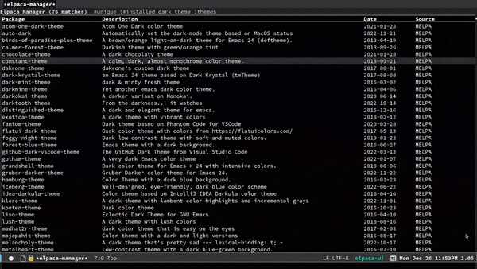

# Elpaca: An Elisp Package Manager

<p align="center"></p>

<p align="center">"Chews data, spits packages."</p>

Elpaca is an elisp package manager. It allows users to find, install, update, and remove third-party packages for Emacs. It is a replacement for the built-in Emacs package manager, package.el.

Elpaca:

-   Installs packages asynchronously, in parallel for fast, non-blocking installations.
-   Includes a flexible UI for finding and operating on packages.
-   Downloads packages from their sources for convenient elisp development.
-   Supports thousands of elisp packages out of the box (MELPA, NonGNU/GNU ELPA, Org/org-contrib).
-   Makes it easy for users to create their own ELPAs.

See the [manual](./doc/manual.md) and [wiki](https://github.com/progfolio/elpaca/wiki) for in-depth information on Elpaca usage, customization, and development. Users who wish to experiment with Elpaca may find the example [init.el](./doc/init.el) and [early-init.el](./doc/early-init.el) files useful.


# Video Tour

<p align="center"><a href="https://www.youtube.com/watch?v=5Ud-TE3iIQY"></a></p>


## Installation


### Requirements

Elpaca requires:

-   Emacs >= 27.1
-   git (minimum version TBD)


<a id="installer"></a>

### Installer

To install Elpaca, add the following elisp to your init.el. It must come before any calls to other Elpaca functions/macros. This will clone Elpaca into your `user-emacs-directory` under the `elpaca` subdirectory. It then builds and activates Elpaca.

```emacs-lisp
(defvar elpaca-installer-version 0.11)
(defvar elpaca-directory (expand-file-name "elpaca/" user-emacs-directory))
(defvar elpaca-builds-directory (expand-file-name "builds/" elpaca-directory))
(defvar elpaca-repos-directory (expand-file-name "repos/" elpaca-directory))
(defvar elpaca-order '(elpaca :repo "https://github.com/progfolio/elpaca.git"
                              :ref nil :depth 1 :inherit ignore
                              :files (:defaults "elpaca-test.el" (:exclude "extensions"))
                              :build (:not elpaca--activate-package)))
(let* ((repo  (expand-file-name "elpaca/" elpaca-repos-directory))
       (build (expand-file-name "elpaca/" elpaca-builds-directory))
       (order (cdr elpaca-order))
       (default-directory repo))
  (add-to-list 'load-path (if (file-exists-p build) build repo))
  (unless (file-exists-p repo)
    (make-directory repo t)
    (when (<= emacs-major-version 28) (require 'subr-x))
    (condition-case-unless-debug err
        (if-let* ((buffer (pop-to-buffer-same-window "*elpaca-bootstrap*"))
                  ((zerop (apply #'call-process `("git" nil ,buffer t "clone"
                                                  ,@(when-let* ((depth (plist-get order :depth)))
                                                      (list (format "--depth=%d" depth) "--no-single-branch"))
                                                  ,(plist-get order :repo) ,repo))))
                  ((zerop (call-process "git" nil buffer t "checkout"
                                        (or (plist-get order :ref) "--"))))
                  (emacs (concat invocation-directory invocation-name))
                  ((zerop (call-process emacs nil buffer nil "-Q" "-L" "." "--batch"
                                        "--eval" "(byte-recompile-directory \".\" 0 'force)")))
                  ((require 'elpaca))
                  ((elpaca-generate-autoloads "elpaca" repo)))
            (progn (message "%s" (buffer-string)) (kill-buffer buffer))
          (error "%s" (with-current-buffer buffer (buffer-string))))
      ((error) (warn "%s" err) (delete-directory repo 'recursive))))
  (unless (require 'elpaca-autoloads nil t)
    (require 'elpaca)
    (elpaca-generate-autoloads "elpaca" repo)
    (let ((load-source-file-function nil)) (load "./elpaca-autoloads"))))
(add-hook 'after-init-hook #'elpaca-process-queues)
(elpaca `(,@elpaca-order))
```

-   Windows users must be able to create symlinks<sup><a id="fnr.-0-1" class="footref" href="#fn.-0-1" role="doc-backlink">1</a></sup>, or enable `elpaca-no-symlink-mode`

```emacs-lisp
;; Uncomment for systems which cannot create symlinks:
;; (elpaca-no-symlink-mode)
```

You'll also want to disable package.el in your early-init file<sup><a id="fnr.-0-2" class="footref" href="#fn.-0-2" role="doc-backlink">2</a></sup>:

```emacs-lisp
(setq package-enable-at-startup nil)
```

And remove anything related to package.el in your init file. e.g. calls to `(package-activate-all)`.


## Quick Start

| Operation                             | UI (keys apply in elpaca-ui-mode)   | completing-read interface commands     |
|------------------------------------- |----------------------------------- |-------------------------------------- |
| Finding Packages                      | `g` `m` (or `M-x` `elpaca-manager`) | `elpaca-info`                          |
| Trying Packages (for current session) | `i` `x`                             | `elpaca-try`                           |
| Fetching Package Updates              | `f` `x`                             | `elpaca-fetch` or `elpaca-fetch-all`   |
| Merging Updates                       | `m` `x`                             | `elpaca-merge` or `elpaca-merge-all`   |
| Updating Packages<sup>\*</sup>        | `p` `x`                             | `elpaca-update` or `elpaca-update-all` |
| Rebuilding Packages                   | `r` `x`                             | `elpaca-rebuild`                       |
| Deleting Packages                     | `d` `x`                             | `elpaca-delete`                        |
| View Package Logs                     | `g` `l`                             | `elpaca-log`                           |
| Visit Package Repository Directory    | `v`                                 | `elpaca-visit`                         |
| Visit Package Build Directory         | `C-u` `v`                           | `C-u M-x` `elpaca-visit`               |
| Browse Package Website                | `b`                                 | `elpaca-browse`                        |

​\* Update is an alias for "pull". It's encouraged to fetch, review, and **then** merge package updates rather than pulling.

Packages installed via the above commands are not loaded on subsequent Emacs sessions (after restarting). To install and load packages persistently (across Emacs restarts), use the `elpaca` macro in your init file after the installer. ([installer](#installer))

For example:

```emacs-lisp
;; Install a package via the elpaca macro
;; See the "recipes" section of the manual for more details.

;; (elpaca example-package)

;; Install use-package support
(elpaca elpaca-use-package
  ;; Enable use-package :ensure support for Elpaca.
  (elpaca-use-package-mode))

;;When installing a package used in the init file itself,
;;e.g. a package which adds a use-package key word,
;;use the :wait recipe keyword to block until that package is installed/configured.
;;For example:
;;(use-package general :ensure (:wait t) :demand t)

;; Expands to: (elpaca evil (use-package evil :demand t))
(use-package evil :ensure t :demand t)

;;Turns off elpaca-use-package-mode current declaration
;;Note this will cause evaluate the declaration immediately. It is not deferred.
;;Useful for configuring built-in emacs features.
(use-package emacs :ensure nil :config (setq ring-bell-function #'ignore))
```

**IMPORTANT**:

Elpaca installs and activates packages asynchronously. Elpaca processes its package queues *after* Emacs reads the init file.<sup><a id="fnr.-0-3" class="footref" href="#fn.-0-3" role="doc-backlink">3</a></sup> Consider the following example:

```emacs-lisp
(elpaca package-a (message "First")) ; Queue First
(message "Second") ; Second messaged
(elpaca package-b (message "Third")) ; Queue Third
(elpaca-process-queues) ; Process queue: First messaged, Third messaged.
```

"Second" will be message *before* "First" and "Third". If a form should be evaluated after a package is installed/activated, put it in that package declaration's *BODY*. Declaration *BODY* forms are evaluated synchronously in declared order. e.g.

```emacs-lisp
(elpaca package-a (message "First") (message "Second"))  ; Queue First, Second
(elpaca package-b (message "Third"))  ; Queue Third
(elpaca-process-queues) ; Process queue: First, Second, then Third messaged.
```

Add configuration which relies on `after-init-hook`, `emacs-startup-hook`, etc to `elpaca-after-init-hook` so it runs after Elpaca has activated all queued packages. This includes loading of saved customizations. e.g.

```emacs-lisp
(setq custom-file (expand-file-name "customs.el" user-emacs-directory))
(add-hook 'elpaca-after-init-hook (lambda () (load custom-file 'noerror)))
```

## Footnotes

<sup><a id="fn.1" class="footnum" href="#fnr.1">1</a></sup> [windows symlink guide](https://www.howtogeek.com/16226/complete-guide-to-symbolic-links-symlinks-on-windows-or-linux/)

<sup><a id="fn.2" class="footnum" href="#fnr.2">2</a></sup> [early-init file](https://www.gnu.org/software/emacs/manual/html_node/emacs/Early-Init-File.html)

<sup><a id="fn.3" class="footnum" href="#fnr.3">3</a></sup> This is so Elpaca can build a proper dependency tree. It ensures packages the user explicitly requests are not preempted by dependencies of other packages.
